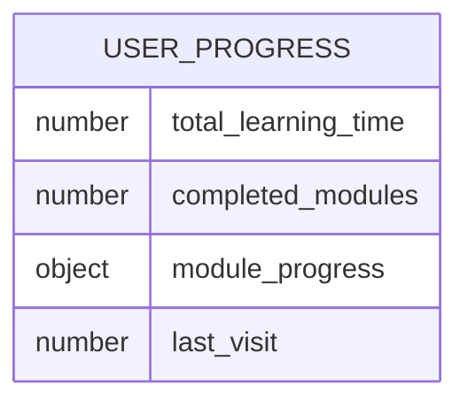

## 1. Architecture Design
```mermaid
graph TB
    A[Frontend - React + Tailwind] --&gt; B[localStorage]
    A --&gt; C[Web Speech API]
    A --&gt; D[Canvas API]
    style A fill:#4A90E2
    style B fill:#F5A623
    style C fill:#7ED321
    style D fill:#9013FE
```

## 2. Technology Description
- Frontend: React@18 + TypeScript + tailwindcss@3 + vite
- Initialization Tool: vite-init
- Backend: None（使用 localStorage 存储进度）
- Database: localStorage
- 语音功能: Web Speech API
- 绘图功能: Canvas API

## 3. Route Definitions
| Route | Purpose |
|-------|---------|
| / | 首页导航和进度概览 |
| /learning | 互动学习模块选择 |
| /learning/alphabet | 字母学习页面 |
| /learning/animals | 动物认知页面 |
| /learning/plants | 植物认知页面 |
| /learning/objects | 物品认知页面 |
| /speaking | 口语跟读模块选择 |
| /speaking/greetings | 日常问候练习 |
| /speaking/housework | 做家务练习 |
| /speaking/travel | 旅游练习 |
| /speaking/zoo | 动物园练习 |
| /speaking/garden | 植物园练习 |
| /progress | 学习进度页面 |

## 4. API Definitions
无后端 API，使用 localStorage 存储数据。

## 5. Server Architecture Diagram
无后端服务。

## 6. Data Model
### 6.1 Data Model Definition


### 6.2 Data Definition Language
使用 localStorage 存储 JSON 格式数据：
```javascript
// 存储结构示例
{
  totalLearningTime: 3600, // 秒
  completedModules: ['alphabet', 'animals'],
  moduleProgress: {
    alphabet: { completed: 26, total: 26 },
    animals: { completed: 10, total: 20 },
    plants: { completed: 5, total: 15 },
    objects: { completed: 8, total: 18 }
  },
  lastVisit: 1718888888888
}
```
